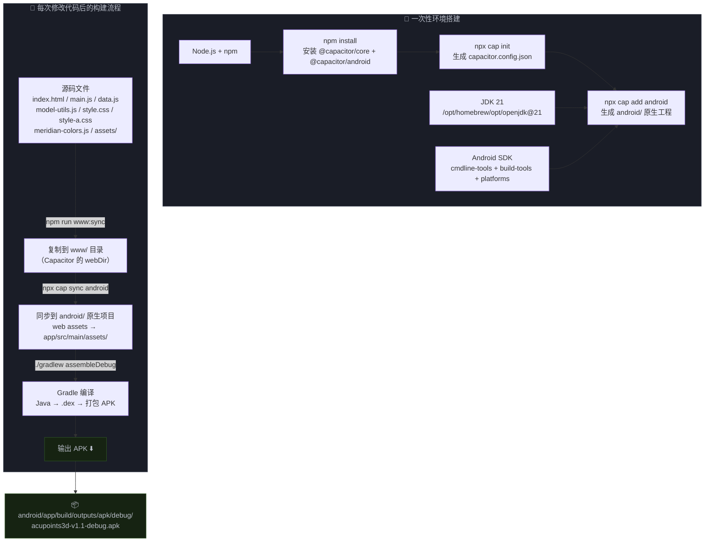

# Acupoints3D APK 构建流程图



---

## 每一步"为什么需要"

### 一、环境搭建

#### 1. Node.js + npm

| 为什么需要 | 不是可选的 |
|---|---|
| Capacitor CLI 是 Node.js 包，`npx cap` 命令依赖 Node 运行时 | 没有它就根本没有构建工具链的入口 |

#### 2. JDK 21

| 为什么需要 | 不是可选的 |
|---|---|
| Android 原生工程里的 Java/Kotlin 代码需要 JDK 来编译 | Gradle 本身就是 JVM 程序，没有 JDK 连 `./gradlew` 都启动不了 |
| Capacitor 生成的 `MainActivity.java` 是 Java 类，必须编译成 `.class` 再转 `.dex` 才能跑在 Android 上 | 即使你一行 Java 不写，工程骨架里也有必须编译的 Java 代码 |

#### 3. Android SDK

| 组件 | 为什么需要 |
|---|---|
| `platforms/android-34/android.jar` | 编译时引用 Android 系统 API（WebView、Activity 生命周期等），没有它 Java 代码编译不过 |
| `build-tools/` | 包含 `d8`（java bytecode → DEX 字节码）、`aapt2`（资源编译打包）、`zipalign`（APK 对齐优化）——每一步都是硬依赖 |
| `platform-tools/adb` | 调试时把 APK 装到手机、查看 logcat，打包阶段不强制需要，但开发离不了 |

#### 4. `npm install`

| 为什么需要 | 装了啥 |
|---|---|
| 下载 Capacitor 全家桶到本地 `node_modules/` | `@capacitor/core`：web 端运行时，在 HTML 里提供 Capacitor 插件 API |
| | `@capacitor/android`：Android 原生端的桥接层，`MainActivity` 的父类 `BridgeActivity` 就来自这里 |
| | `@capacitor/cli`：提供 `npx cap` 命令行工具 |

#### 5. `npx cap init`

| 为什么需要 | 产物 |
|---|---|
| 创建 `capacitor.config.json`，这是 Capacitor 的"身份证" | `appId`：Android 包名，决定 APK 的唯一标识（`com.bo3d.acupoints3d`） |
| | `appName`：手机上显示的应用名 |
| | `webDir`：告诉 Capacitor "你的 web 资源在哪个目录"——后面每一步都靠这个路径 |

#### 6. `npx cap add android`

| 为什么需要 | 产物 |
|---|---|
| 基于 capacitor.config.json 生成完整的 Android 原生工程骨架 | `android/` 目录包含 `build.gradle`、`settings.gradle`、`gradlew`、`AndroidManifest.xml` |
| | `MainActivity.java` → 继承 `BridgeActivity`，启动 WebView 加载你的 HTML |
| | 这一步做完，你的 web 项目就变成了一个真正的 Android app 项目 |

---

### 二、每次改代码后的三步构建

#### ① `npm run www:sync` — 收集发布资源

```bash
rm -rf www && mkdir -p www && cp index.html style.css main.js data.js model-utils.js www/ && cp -R assets www/assets
```

| 为什么需要这一步 |
|---|
| **隔离脏文件**：源码目录里有 `.git`、备份文件（`.bak`）、`node_modules/`，这些绝对不能打进 APK |
| **指定生产文件清单**：只挑运行时需要的 HTML/JS/CSS/3D 模型文件，用一个干净目录 `www/` 作为"发布候选" |
| **Capacitor 的约定**：`webDir` 指向 `www/`，下一步 `cap sync` 从这个目录读取 |

#### ② `npx cap sync android` — 注入到原生工程

| 为什么需要这一步 |
|---|
| **物理搬运 web 资源**：Capacitor 把 `www/` 下的所有文件拷贝到 `android/app/src/main/assets/public/`——这是 Android 系统存取应用内静态资源的固定位置 |
| **更新原生配置**：如果 Capacitor 插件有版本变化，sync 会更新 `build.gradle` 里的依赖声明和 `AndroidManifest.xml` 的权限 |
| **没有这一步会怎样**：APK 打得出来，但里面装的还是上一次 sync 时的旧 HTML/JS，你的代码修改根本没进去 |

#### ③ `./gradlew assembleDebug` — 真正打包

| 为什么需要这一步 |
|---|
| **编译 Java 代码**：`javac` 把 `MainActivity.java` 编译成 `.class` 字节码，然后 `d8` 转成 Android 可执行的 `.dex` 格式 |
| **打包所有资源**：`aapt2` 把 `AndroidManifest.xml`、`assets/` 下的 HTML/JS/CSS/3D 模型、编译好的 DEX 文件，全部压缩到一个 APK 里 |
| **签名**：debug 构建用 Android SDK 自带的 debug keystore 自动签名，不然无法安装到手机 |
| **输出**：`android/app/build/outputs/apk/debug/acupoints3d-v<x>.<y>-debug.apk` |

---

## 一句话总结

> Capacitor 的本质就是：**把你的前端项目塞进一个 Android WebView 壳里**。
>
> `www:sync` 负责挑出要塞的内容 → `cap sync` 把内容搬到壳里正确的位置 → `gradlew assembleDebug` 把壳封口、签名、输出 APK。

---

## ⚠️ 已知问题

当前 `www:sync` 脚本遗漏了两个文件：

- `meridian-colors.js` — 经络颜色映射（Style A 依赖）
- `style-a.css` — 深色医学风主题

修复方式：在 `package.json` 的 `www:sync` 命令里加上它们。
